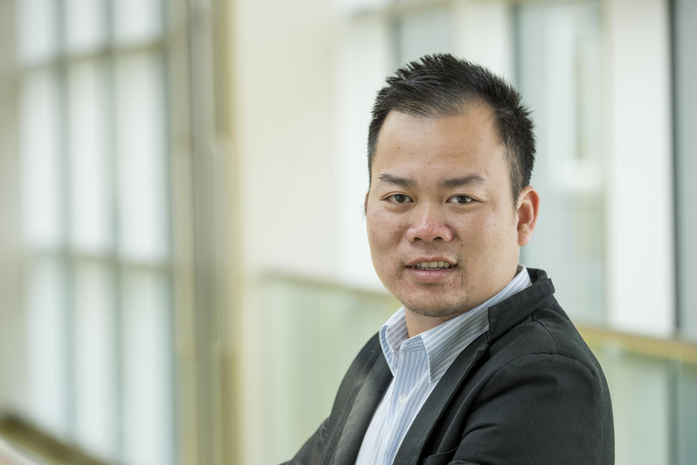

## Dr. Hoang Phuoc, Le 

Welcome to my home page

Currently, I am a __Principal Data Scientist__ at [CooperVision](https://coopervision.co.uk) in the UK. Here is my [*Linkedin page*](https://www.linkedin.com/in/phuochoangle/), go ahead to send me a message if you want to connect.

My work focuses on delivering value of AI, Data Science and Machine Automation into the area of Heathcare, Education and Industrial Applications.
Previously, I led the Data Science team of a non-profit organization [*STEAM for Vietnam*](https://steamforvietnam.org/) to provide __free world-class MOOC education__ (Science, Technology, Engineering, Arts, and Math) for Vietnamese children.

### Research Interests:
My research focuses on the topic of **Machine Learning, Deep Learning and Artificial Intelligence**, in particular, the statistical modelling and mathematical optimisation of several problems in Data Analytics and Decision Science.

In 2017, I defended my *Ph.D. thesis* in Economics on the topic of ‘**Payoff Allocation Methods for Several Operational Research Games**’. The project developed strategies and algorithms for finding fair & stable payoff allocations using *Algorithmic Game Theory, Combinatorial Optimisation, Statistical Analysis*. Several application areas of this work include *Energy, Supply Chain Management, and Network Design*.

After academia, I have worked and consulted for several projects in different industries such as insurance (*Ages UK*), IT consultancy (*IBM*), and aviation (*FDS Ltd - L3Harris Technology*).  
